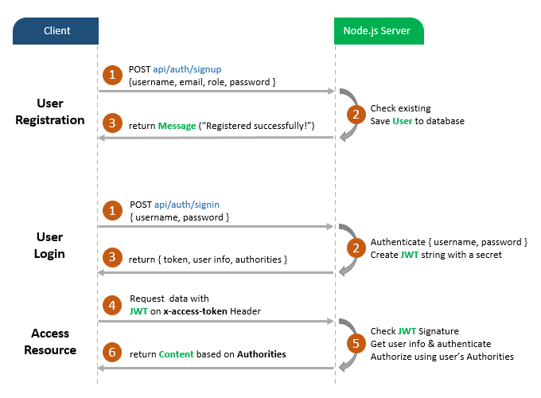

# Node.js MongoDB – User Authentication & Authorization example with JWT & Mongoose

## User Registration, User Login and Authorization process.
The diagram shows flow of how we implement User Registration, User Login and Authorization process.



You may need to implement Refresh Token:


> [Node.js JWT Refresh Token with MongoDB example](https://github.com/kabirul/jwt-refresh-token-node-js-mongodb/)

## More Practice:
> [Node.js, Express & MongoDb: Build a CRUD Rest Api example](https://github.com/kabirul/node-express-mongodb-crud-rest-api/)

> [Server side Pagination in Node.js with MongoDB and Mongoose](https://github.com/kabirul/node-js-mongodb-pagination/)

> [Node.js Express File Upload Rest API example](https://github.com/kabirul/node-js-express-static-file-upload/)

> [Node.js + MongoDB: User Login and Registration Authentication (using HTTP headers)](https://github.com/kabirul/node-js-express-login-mongodb/)

##Technology

> cors 2.8.5

> express 4.17.1

> cookie-session 1.4.0

> bcryptjs 2.4.3

> jsonwebtoken 8.5.1

> mongoose 5.13.13

> MongoDB

## Project setup
```
npm install
```

### Run
```
node server.js
```
